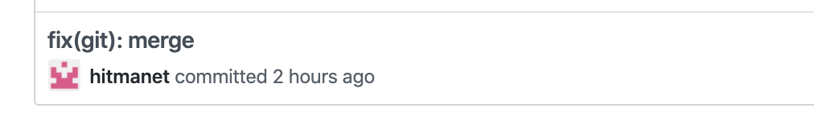

# Git flow

## Правила оформления коммитов

**???**  Описание работы с комитизеном

Для оформления сообщения коммита следует использовать следующий шаблон:

```
type(scope): subject

body
```

### Type

Возможные типы:

* feature - используется при добавлении новой функциональности
* fix - исправление баги
* docs - всё, что касается документации
* style - исправляем опечатки, исправляем форматирование
* refactor - рефакторинг кода
* test - всё, что связано с тестированием
* chore - обычное обслуживание кода

### Scope

**???**  что мы обычно пишем в скоп?

### Subject

Предпочтительней писать по-русски

**Общий стиль:**

```
действие (с маленькой буквы) + для какой сущности + (необязательно подробности)
```

**На русском:**

Первое слово - отглагольное существительное.

```
исправление ошибки рендера в Button
```

**На английском:**

Первое слово - глагол в неопределнной форме.

```
fix render error in Button
```

### Body

Заполнение тела коммита опционально. Нужно в том случае, если описание решенной проблемы достаточно сложно и не может уместиться в строку заголовка. Также сюда можно писать номер закрываемого (закрываемых) тасков из Джиры или тикетов с Гитхаба. Тело сообщения отделяется от заголовка одной пустой строкой и заполняется произвольно.

### Примеры

```
feature(hooks): добавление хука useSelect

test(components): написание теста для Select

fix(components): fix render error in Button
```

## Правила оформления PR

> Возможно мы решим просто сквошить все ПРы, и париться только про описание ПРа, зато не париться про именование коммитов

**???** Добавить описание по оформлению ПР с картинками.

## Для мейнтейниров

### Merge PR

**Использовать мерж, ребейз или сквош для вливания фича-веток, в зависимости от ситуации (описать когда какой способ использовать)**


Оставлять имя мерж-коммита по умолчанию

* **Правильно**


* **Неправильно**
