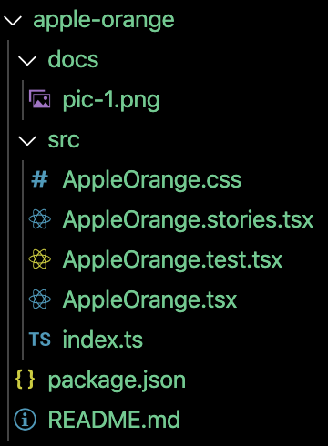

# Добавление нового компонента

Порядок действий для создания нового компонента.

## Автоматическое добавление нового компонента

```
yarn hygen component new [name]
```

или

```
yarn nc [name]
```

Для работы с шаблонами используется утилита [hygen](https://www.hygen.io/). Шаблон описан в директории: `_templates/component/new`.<br>
Добавлен короткий синтаксис: `yarn nc [name]`

### Действия при выполнении шаблона нового компонента

Рассмотрим на примере команды `yarn nc apple-orange`.

В `package.json` добавит новую запись в раздел `workspaces`: `"packages/components/apple-orange:`<br>
В `packages/components/index.ts` добавит новый экспорт: `export * from '@gpn-prototypes/vega-apple-orange';`<br>
В `packages/components/package.json` добавит новую запись в раздел `dependencies`: `"@gpn-prototypes/vega-apple-orange": "^0.0.1"`<br>
В `packages/components/README.md` добавит новую ссылку на документацию: `- [AppleOrange](apple-orange)`<br>
Добавит папку `packages/components/apple-orange` со следующей структурой:



## Статус и автор

Для нового компонента в Сторибуке необходимо указать его автора и статус.


Возможные статусы:<br>
_Approved_ — компонент закончен и прошел проверку. Готов к использованию<br>
_Draft_ — компонент не доработан/не прошел проверку. Может содержать баги<br>
_Deprecated_ — компонент устарел и будет удален в следующих мажорных обновлениях. Не рекомендуется к использованию<br>

### Пример использования

Для добавления указанной информации необходимо воспользоваться методом `addParameters` на уровне истории всего компонента и передать объект со свойством `metadata`. Подробней про декоратор `withMetadata` можно прочитать [тут](storybook.md#Декоратор-для-Сторибука-withMetadata).

```jsx
storiesOf('ui/Component', module)
  .addDecorator(withKnobs)
  .addParameters({ metadata: { author: 'Дизайн-система ГПН', status: 'Approved' } })
  .add('Component', () => <Component {...defaultKnobs()} />);
```
