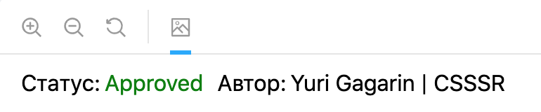

# Добавление нового компонента

Порядок действий для создания нового компонента.

...

## Статус и автор

Для нового компонента в Сторибуке необходимо указать его автора и статус.



Возможные статусы:<br>
_Approved_ - компонент прошел проверку<br>
_Draft_ - компонент не доработан/не прошел проверку<br>
_Deprecated_ - компонент признан устаревшим и будет удален из библиотеки в следующих мажорных обновлениях<br>

Автор: Имя Фамилия | Компания

### Пример использования

Для добавления указанной информации необходимо воспользоваться методом `addParameters` на уровне истории всего компонента и передать объект со свойством `metadata`. Подробней про декоратор `withMetadata` можно прочитать [тут](tools.md#Декоратор-для-Сторибука-withMetadata).

```jsx
import { Status } from '../../../../.storybook/with-metadata';

// ...

storiesOf('ui/Component', module)
  .addDecorator(withKnobs)
  .addParameters({ metadata: { author: 'Yuri Gagarin | CSSSR', status: Status.Approved } })
  .add('Component', () => <Component {...defaultKnobs()} />);
```
