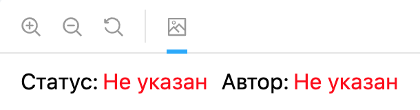
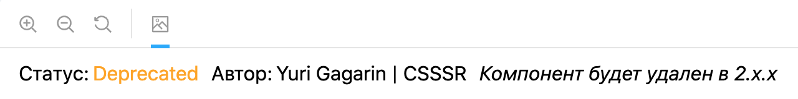

# Инструменты

Описание самописных инструментов, используемых в библиотеке.

## Декоратор для Сторибука `withMetadata`

Декоратор добавляет метаинформацию к компоненту в Сторибуке.<br>
Исходный код: `.storybook/with-metadata/index.tsx`


### Использование

Для добавления метаинформации необходимо воспользоваться методом `addParameters` на уровне истории всего компонента и передать объект со свойством `metadata`.

```jsx
import { Status } from '../../../../.storybook/with-metadata';

// ...

storiesOf('ui/Component', module)
  .addDecorator(withKnobs)
  .addParameters({ metadata: { author: 'Yuri Gagarin | CSSSR', status: Status.Approved } })
  .add('Component', () => <Component {...defaultKnobs()} />);
```

Декоратор принимает следующие параметры:<br>
_status_ — статус компонента. Возможные значения указаны ниже<br>
_author_ — автор компонента в формате: Имя Фамилия | Компания<br>
_description_ — короткое описание. Сценарии использования указаны ниже<br>

**Обратите внимание**. Для указания статуса нужно использовать перечисляемый тип (enum), определенный в `.storybook/with-metadata` .

Возможные статусы:<br>
_Approved_ — компонент прошел проверку<br>
_Draft_ — компонент не доработан/не прошел проверку<br>
_Deprecated_ — компонент признан устаревшим и будет удален из библиотеки в следующих мажорных обновлениях<br>

#### Действия декоратора по умолчанию

В случае если _author_ или _status_ для компонента не указаны, декоратор заменит отсутствующие значения текстом "Не указан" и подсветит его красным цветом.



#### Сценарии использования свойства `description`

Основная цель свойства `description` — указать необходимое пояснение к статусу.

Например, с помощью этого свойства можно дополнить статус _Deprecated_ и указать версию пакета, в которой компонент будет полностью удален. Или можно указать новый компонент, который предлагается использовать вместо устаревшего.



```jsx
storiesOf('ui/Component', module)
  .addDecorator(withKnobs)
  .addParameters({
    metadata: {
      author: 'Yuri Gagarin | CSSSR',
      status: Status.Deprecated,
      description: 'Компонент будет удален в 2.x.x',
    },
  })
  .add('Component', () => <Component {...defaultKnobs()} />);
```

Не стоит использовать свойство для описания особенностей использования/работы компонента, для этих целей используйте отдельный файл README.
