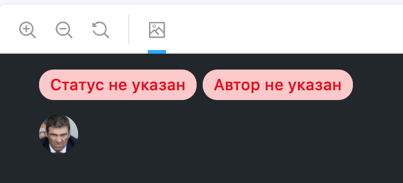
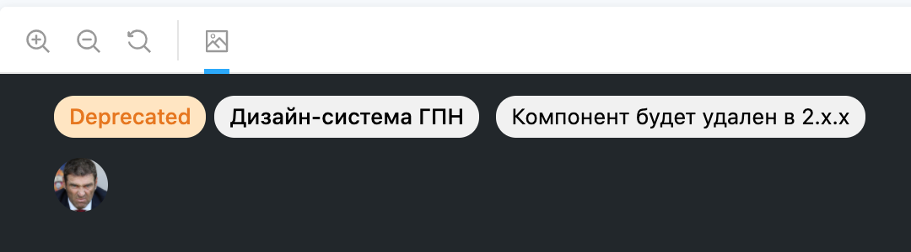

# Инструменты

Описание самописных инструментов, используемых в библиотеке.

## Декоратор для Сторибука `withMetadata`

Декоратор добавляет метаинформацию к компоненту в Сторибуке.<br>
Исходный код: `.storybook/with-metadata/index.tsx`


### Использование

Для добавления метаинформации необходимо воспользоваться методом `addParameters` на уровне истории всего компонента и передать объект со свойством `metadata`.

```jsx
storiesOf('ui/Component', module)
  .addDecorator(withKnobs)
  .addParameters({ metadata: { author: 'Дизайн-система ГПН', status: 'Approved' } })
  .add('Component', () => <Component {...defaultKnobs()} />);
```

Декоратор принимает следующие параметры:<br>
_status_ — статус компонента. Возможные значения указаны ниже<br>
_author_ — автор компонента<br>
_description_ — короткое описание. Сценарии использования указаны ниже<br>

Возможные статусы:<br>
_Approved_ — компонент закончен и прошел проверку. Готов к использованию<br>
_Draft_ — компонент не доработан/не прошел проверку. Может содержать баги<br>
_Deprecated_ — компонент устарел и будет удален в следующих мажорных обновлениях. Не рекомендуется к использованию<br>

#### Действия декоратора по умолчанию

В случае если _author_ или _status_ для компонента не указаны, декоратор заменит отсутствующие значения текстом "не указан" и подсветит его красным цветом.



#### Сценарии использования свойства `description`

Основная цель свойства `description` — указать необходимое пояснение к статусу.

Например, с помощью этого свойства можно дополнить статус _Deprecated_ и указать версию пакета, в которой компонент будет полностью удален. Или можно указать новый компонент, который предлагается использовать вместо устаревшего.



```jsx
storiesOf('ui/Component', module)
  .addDecorator(withKnobs)
  .addParameters({
    metadata: {
      author: 'Дизайн-система ГПН',
      status: 'Deprecated',
      description: 'Компонент будет удален в 2.x.x',
    },
  })
  .add('Component', () => <Component {...defaultKnobs()} />);
```

Не стоит использовать свойство для описания особенностей использования/работы компонента, для этих целей используйте отдельный файл README.
