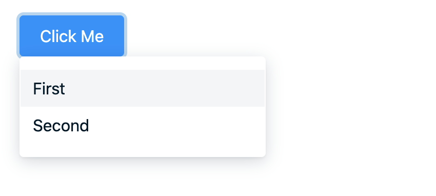

# @vega-ui/dropdown

Компонент является элементом, который выпадает из trigger-элемента



### Установка

```
yarn add @vega-ui/dropdown
```

### Пример использования

```jsx
import { Dropdown } from '@vega-ui/dropdown';

export const MyComponent = () => {
  const [isOpen, setIsOpen] = React.useState<boolean>(false);
  const [activeItem, setActiveItem] = React.useState<string>('first');

  const triggerNode = <Button label="Click Me" onClick={(): void => setIsOpen(!isOpen)} />;

  return (
    <Dropdown isOpen={isOpen} trigger={triggerNode} onClose={(): void => setIsOpen(false)}>
      <Dropdown.Menu activeName={activeItem} onChangeActive={setActiveItem}>
        <Dropdown.Item name="first">
          <Text>First</Text>
        </Dropdown.Item>
        <Dropdown.Item name="second">
          <Text>Second</Text>
        </Dropdown.Item>
      </Dropdown.Menu>
    </Dropdown>
  );
  );
};
```

### API компонента

```ts
type ModalProps = {
  onClose: React.EventHandler<React.MouseEvent | React.KeyboardEvent>; // Метод для закрытия модального окна
  isOpen?: boolean; // Индикация того, что модального окно открыто
  hasCloseButton?: boolean; // Нужно ли рендерить крестик для закрытия
  children?: React.ReactNode;
  hasOverlay?: boolean; // Нужно ли рендерить оверлей
  onOverlayClick?: (e: React.SyntheticEvent) => void; // Метод, который вызовется по клику на оверлей (по умолчанию onClose)
  rootSelector?: string; // Селектор, в котором рендерить модальное окон (по умолчанию body)
  closeByEsc?: boolean; // Нужно ли закрывать модальное окно по нажатию на esc
};
```

`Modal.Header`, `Modal.Body` и `Modal.Footer` принимают пропсы `className` и `testId` для установки кастомного класса и айди для теста.

### API useModal

Хук для упрощения работы с модальным окном

Принимает на вход

```
{ initialOpen: boolean } - открыто ли модальное окно по умолчанию
```

Возвращает

```
isOpen - индикация того, что модальное окно открыто
handleOpen - метод для открытия модального окна
handleClose - метод для закрытия модального окна
```

Компонент рендерит React-портал.
