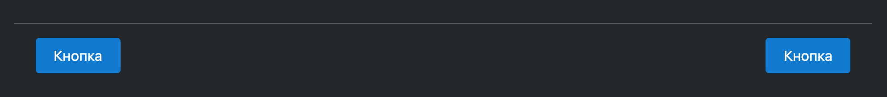

# @vega-ui/footer-page

Компонент "Футер страницы"



### Установка

```
yarn add @vega-ui/footer-page
```

### Примеры использования

#### Кнопки с одной стороны

```jsx
import { FooterPage } from '@vega-ui/footer-page';
import { Button } from '@vega-ui/button';

export const MyComponent = () => {
  return (
    <FooterPage className="footer">
      <Button size="m" view="primary" label="Кнопка" />
    </FooterPage>
  );
};
```

```css
.footer {
  display: flex;
  justify-content: flex-end;
}
```

#### Кнопки с двух сторон

```jsx
import { FooterPage } from '@vega-ui/footer-page';
import { Button } from '@vega-ui/button';

export const MyComponent = () => {
  return (
    <FooterPage className="footer">
      <div>
        <Button size="m" view="primary" label="Кнопка" />
      </div>
      <div>
        <Button size="m" view="primary" label="Кнопка" />
      </div>
    </FooterPage>
  );
};
```

```css
.footer {
  display: flex;
  justify-content: space-between;
}
```

### API

```ts
type FooterPageProps = {
  className?: string;
  testId?: string;
};
```
