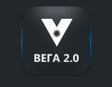

# @vega-ui/Logo

Логотип Vega 2.0



### Установка

```bash
$ yarn add @gpn-prototypes/vega-logo
```

### Пример использования

```jsx
import { Logo } from '@gpn-prototypes/vega-logo';

export const MyComponent = () => {
  return <Logo />;
};
```

### API компонента

```ts
type LogoProps = {
  className?: string;
  size?: 'm';
};
```
