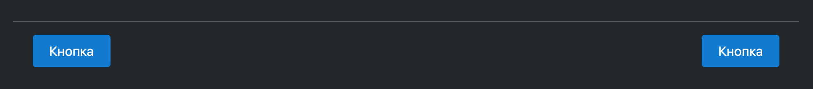

# @gpn-prototypes/vega-page-footer

Компонент "Футер страницы"



### Установка

```
yarn add @gpn-prototypes/vega-page-footer
```

### Примеры использования

#### Кнопки с одной стороны

```jsx
import { PageFooter } from '@gpn-prototypes/vega-page-footer';
import { Button } from '@gpn-prototypes/vega-button';

export const MyComponent = () => {
  return (
    <PageFooter className="footer">
      <Button size="m" view="primary" label="Кнопка" />
    </PageFooter>
  );
};
```

```css
.footer {
  display: flex;
  justify-content: flex-end;
}
```

#### Кнопки с двух сторон

```jsx
import { PageFooter } from '@gpn-prototypes/vega-page-footer';
import { Button } from '@gpn-prototypes/vega-button';

export const MyComponent = () => {
  return (
    <PageFooter className="footer">
      <div>
        <Button size="m" view="primary" label="Кнопка" />
      </div>
      <div>
        <Button size="m" view="primary" label="Кнопка" />
      </div>
    </PageFooter>
  );
};
```

```css
.footer {
  display: flex;
  justify-content: space-between;
}
```

### API

```ts
type PageFooterProps = {
  className?: string;
  testId?: string;
};
```
